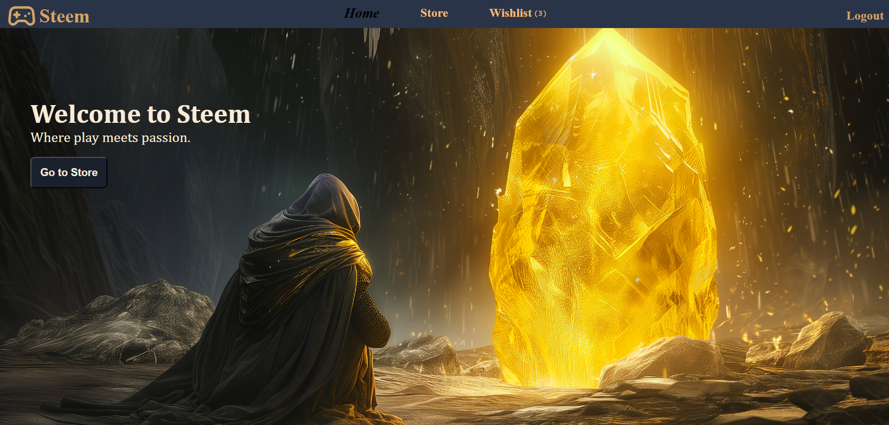
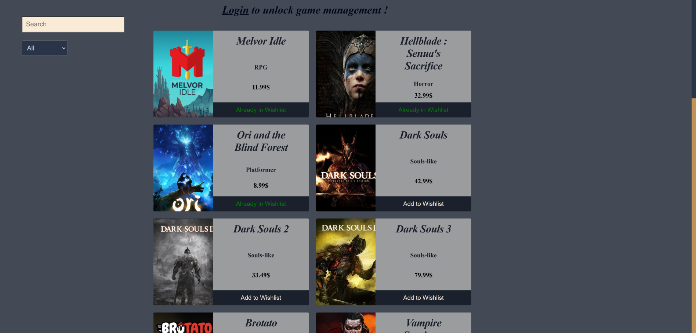
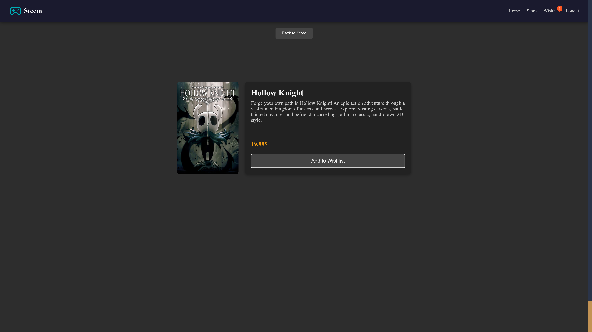

# Steem React App

**Steem** is a React-based e-commerce platform tailored for video game enthusiasts. The app features a dynamic storefront with a comprehensive catalog of video games, personalized user wishlists, and detailed game pages. It connects to a **MongoDB** database for data management and leverages React Router for seamless navigation between pages.

---

<table>
  <tr>
    <td>
      
    </td>
    <td>
      <b>Main Page:</b>
      

        The main page serves as the entry point to the app, providing users with a curated overview of the platform. It includes quick navigation links to the store, wishlist, and other features. The layout is clean and responsive, ensuring accessibility across devices.
      

    </td>
  </tr>
  <tr>
    <td>
      
    </td>
    <td>
      <b>Store Page:</b>
      

        The store page dynamically displays video games fetched from the **MongoDB database**. Each game is presented in a card layout, with options to view details or add to the wishlist. The data is fetched using Axios and managed effectively in the state.
      

    </td>
  </tr>
  <tr>
    <td>
      
    </td>
    <td>
      <b>Wishlist Page:</b>
      

        The wishlist page is unique to every user and showcases games that they’ve favorited. It enables users to manage their personalized collections and interact with the games they’re most interested in. This feature is powered by user authentication and database relations.
      

    </td>
  </tr>
  <tr>
    <td>
      
    </td>
    <td>
      <b>Game Details Page:</b>
      

        The game details page provides in-depth information about a selected game, including its title, description, price, and reviews. Navigation to this page is handled through **React Router**, ensuring a smooth transition while passing game data as props.
      

    </td>
  </tr>
</table>

