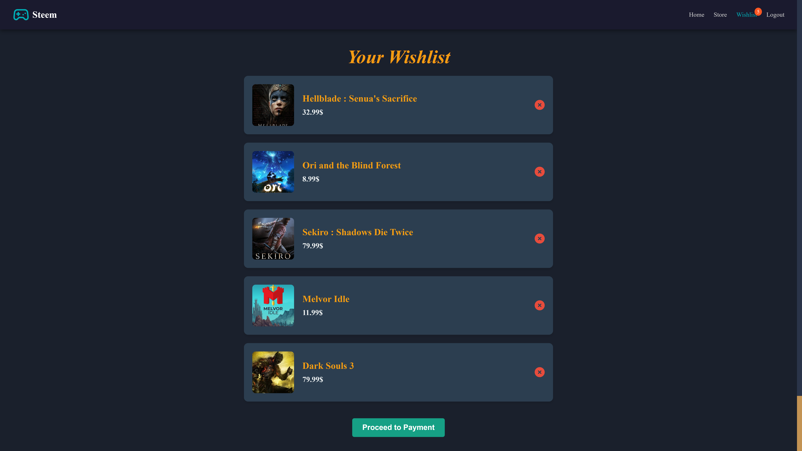

<h1>Steem React App</h1>

<h3><strong>Steem</strong> is a React-based e-commerce platform tailored for video game enthusiasts. The app features a dynamic storefront with a comprehensive catalog of video games, personalized user wishlists, and detailed game pages. It connects to a <strong>MongoDB</strong> database for data management and leverages React Router for seamless navigation between pages.</h3>

<h3>Technologies Used</h3>
<ul>
  <li><strong>React</strong> – A JavaScript library used to build the user interface and components.</li>
  <li><strong>MongoDB</strong> – A NoSQL database used to store and manage game data, user data, and wishlist information.</li>
  <li><strong>Axios</strong> – A promise-based HTTP client for making requests to the server and fetching game data.</li>
  <li><strong>React Router</strong> – Used for navigation between pages, ensuring a smooth and seamless user experience.</li>
  <li><strong>Node.js</strong> – A JavaScript runtime used for the backend server and interacting with MongoDB.</li>
  <li><strong>Express.js</strong> – A backend framework used for building RESTful APIs to interact with the front end.</li>
</ul>

<h3>Features</h3>
<ul>
  <li><strong>Dynamic Storefront</strong>: A catalog of video games fetched from MongoDB and dynamically displayed in a clean, card-based layout.</li>
  <li><strong>Personalized Wishlists</strong>: Users can create, view, and manage their own wishlist, which is stored and linked to their account.</li>
  <li><strong>Game Details Page</strong>: Detailed information about each game, including title, description, price, and reviews.</li>
  <li><strong>User Authentication</strong>: Secure authentication for users to manage their profiles, wishlists, and view personalized content.</li>
  <li><strong>Responsive Design</strong>: The app is fully responsive and optimized for different screen sizes and devices.</li>
</ul>

<h3>Screenshots</h3>

<table>
  <tr>
    <td>
      
    </td>
    <td>
      <b>Main Page:</b>
      

        The main page serves as the entry point to the app, providing users with a curated overview of the platform. It includes quick navigation links to the store, wishlist, and other features. The layout is clean and responsive, ensuring accessibility across devices.
      

    </td>
  </tr>
  <tr>
    <td>
      
    </td>
    <td>
      <b>Store Page:</b>
      

        The store page dynamically displays video games fetched from the <strong>MongoDB database</strong>. Each game is presented in a card layout, with options to view details or add to the wishlist. The data is fetched using Axios, and React state management ensures smooth handling of the data.
      

    </td>
  </tr>
  <tr>
    <td>
      
    </td>
    <td>
      <b>Wishlist Page:</b>
      

        The wishlist page is unique to each user and showcases games that they’ve favorited. It enables users to manage their personalized collections and interact with the games they’re most interested in. This feature is powered by user authentication and database relations.
      

    </td>
  </tr>
  <tr>
    <td>
      
    </td>
    <td>
      <b>Game Details Page:</b>
      

        The game details page provides in-depth information about a selected game, including its title, description, price, and reviews. Navigation to this page is handled through <strong>React Router</strong>, ensuring a smooth transition while passing game data as props.
      

    </td>
  </tr>
   </tr>
  <tr>
    <td>
      
    </td>
    <td>
      <b>Login Page:</b>
      

        The login page provides the user with a simple and clean interface to eithe rlogin, or navigate to the signup view. The data is then analyzed and sent to MongoDb database for further use. 
      

    </td>
  </tr>
</table>

<h3>How It Works</h3>

<h4>1. Main Page</h4>

The main page serves as a gateway to the app, featuring quick access to key features such as the store and wishlist. The page dynamically adapts based on the user's authentication state, showing personalized content for logged-in users and general information for guests.

<h4>2. Store Page</h4>

The store page displays a catalog of video games fetched dynamically from the MongoDB database. Games are presented in a card format with options to add to the wishlist or view more details. Axios is used for API calls to retrieve the game data and manage state in React.

<h4>3. Wishlist Page</h4>

Each user has a personalized wishlist that can be viewed and managed. This page shows all the games that the user has added to their wishlist. The data is stored in MongoDB, and each user's wishlist is linked to their account for easy access and modification.

<h4>4. Game Details Page</h4>

The game details page provides in-depth information about a selected game, including its title, description, price, and user reviews. This information is fetched dynamically and passed to the page through React Router, enabling smooth transitions between the store and details pages.

<h4>5. User Authentication</h4>

Users can sign up, log in, and manage their accounts. This authentication ensures that each user has a unique wishlist, which is stored securely in the database. Authentication state is managed using React context or a third-party solution like Firebase or JWT tokens.

